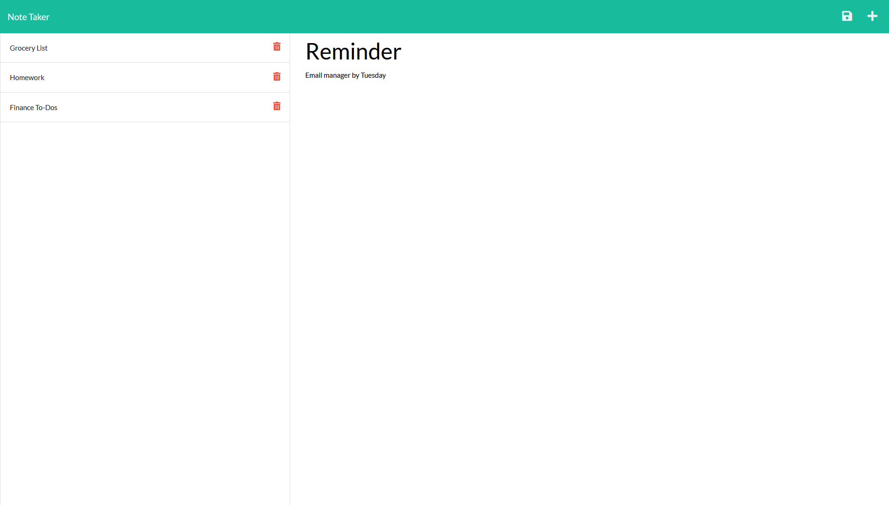

# Description

In this assignment, our task was to modify starter code on the back end to create an application that can be used to write and save notes using the [Express package](https://www.npmjs.com/package/express).

The user is able to enter a note title and text, and save the note. The note is displayed in a list with other notes. The user is able to click through the list to view each note and delete them.

Node.js

# Screenshot

# Link

https://notetaker2122.herokuapp.com/
